# EnergyWise — System Design Document

> Paste any PlantUML block into [planttext.com](https://planttext.com) or the PlantUML VS Code extension to render the diagram.

---

## 1. System Overview

**EnergyWise** is a web-based household electricity forecasting application built for Sri Lankan consumers. Users register an account, enter their appliance profile and previous bills, and the system runs a trained machine learning model to predict the month's electricity consumption (kWh) and estimated CEB bill (LKR). The prediction engine accounts for appliance usage patterns, household size, district-level weather, and the PUCSL-approved CEB tariff structure. Personalised recommendations are generated to help users reduce their bill. An administrator role provides system-level monitoring of all users and predictions.

### Technology Stack

| Layer | Technology |
|---|---|
| Frontend | React 18, Vite, React Router, Axios |
| Backend | Python 3, Flask, Flask-JWT-Extended, SQLAlchemy |
| Database | SQLite (dev) / PostgreSQL (prod) via SQLAlchemy ORM |
| ML Engine | scikit-learn (trained model serialised as `model.pkl`) |
| Weather API | Open-Meteo Archive API (30-day historical averages) |
| Containerisation | Docker, Docker Compose |
| Production Serving | Nginx (frontend), Gunicorn (backend) |

---

## 2. Actors

| Actor | Description |
|---|---|
| **Consumer** | A registered household user. Manages appliances, bills, and runs predictions. |
| **Administrator** | A privileged user (`role = admin`). Monitors system statistics and manages users. |
| **ML Model** | Internal actor. The trained scikit-learn model that produces predicted kWh. |
| **Weather API** | External actor. Open-Meteo archive API that supplies 30-day weather averages. |
| **CEB Tariff Engine** | Internal actor. Calculates LKR bill from predicted kWh using PUCSL tariff schedules. |

---

## 3. Use Case Diagram

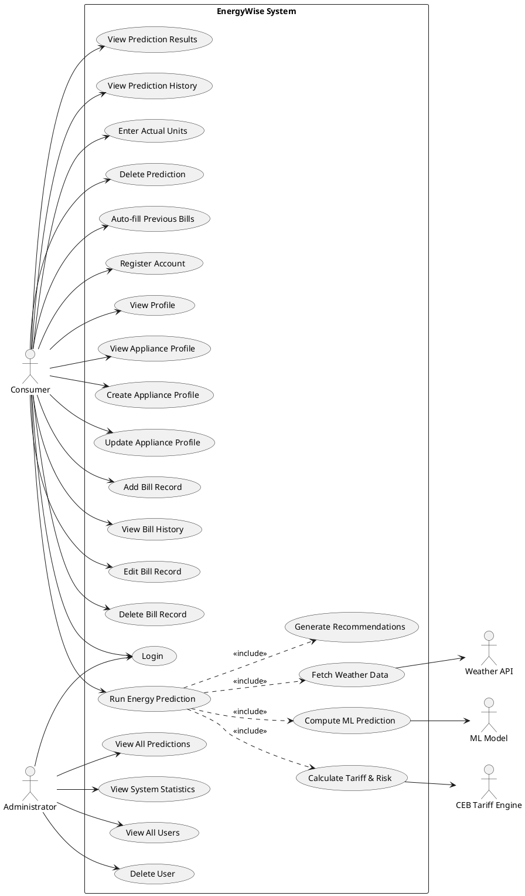

---

## 4. Use Case Descriptions

### UC-01 — Register Account
| Field | Detail |
|---|---|
| **Actor** | Consumer |
| **Precondition** | User does not have an account |
| **Main Flow** | User submits name, email, password, district → System validates → Creates User record → Returns JWT token |
| **Alternative** | Email already registered → System returns 409 Conflict |
| **Postcondition** | User is logged in with a JWT token |

### UC-02 — Login
| Field | Detail |
|---|---|
| **Actor** | Consumer, Administrator |
| **Precondition** | Account exists |
| **Main Flow** | User submits email and password → System verifies bcrypt hash → Returns JWT token and user object |
| **Alternative** | Wrong credentials → 401 Unauthorised |

### UC-03 — Create / Update Appliance Profile
| Field | Detail |
|---|---|
| **Actor** | Consumer |
| **Precondition** | Logged in |
| **Main Flow** | User enters fan count/hours, AC units (individual tons + hours/day), fridge count, washer/heater/other hours → System aggregates AC fields → Saves `UserAppliances` record |
| **Business Rule** | One profile per user (POST creates, PUT updates). AC aggregation: weighted average tons, average hours across individual AC units. |

### UC-04 — Add / Edit / Delete Bill Record
| Field | Detail |
|---|---|
| **Actor** | Consumer |
| **Precondition** | Logged in |
| **Main Flow** | User enters month, year, amount (LKR), optional units (kWh) and notes → Saved to `bills` table |
| **Purpose** | Historical reference; previous bill amounts are used as ML features in the prediction |

### UC-05 — Run Energy Prediction
| Field | Detail |
|---|---|
| **Actor** | Consumer |
| **Precondition** | Logged in; appliance profile preferred but not required |
| **Main Flow** | 1. User submits form (members, prev_bill_1/2/3, appliance overrides, district). 2. System fetches 30-day weather averages from Open-Meteo API for the district. 3. System builds the 21-feature ML input vector. 4. ML model returns predicted kWh. 5. TariffService converts kWh → LKR using PUCSL schedule (Low/Mid/High). 6. Risk level determined (Low ≤60 kWh, Medium ≤180 kWh, High >180 kWh). 7. Recommendations generated. 8. `Prediction` record saved to DB. 9. Response returned to client. |
| **Postcondition** | Prediction stored; user sees kWh, LKR, risk, appliance breakdown, and ranked recommendations |

### UC-06 — Enter Actual Units
| Field | Detail |
|---|---|
| **Actor** | Consumer |
| **Precondition** | Prediction exists; billing period has ended |
| **Main Flow** | User enters actual kWh from CEB bill → System stores `actual_units` and `actual_bill` on the Prediction record |
| **Purpose** | Enables prediction accuracy tracking in the admin dashboard |

### UC-07 — Auto-fill Previous Bills
| Field | Detail |
|---|---|
| **Actor** | Consumer |
| **Precondition** | At least one prior prediction exists |
| **Main Flow** | System reads the most recent prediction, populates prev_bill_1 (actual if entered, else predicted), prev_bill_2, prev_bill_3 from that prediction's inputs |

### UC-08 — View System Statistics (Admin)
| Field | Detail |
|---|---|
| **Actor** | Administrator |
| **Precondition** | Logged in as admin |
| **Main Flow** | Admin views: total consumers, total predictions, average predicted bill, average predicted units, risk level distribution, prediction accuracy % (only for predictions with actual_units entered) |

### UC-09 — View / Delete Users (Admin)
| Field | Detail |
|---|---|
| **Actor** | Administrator |
| **Main Flow** | Paginated list of consumers with prediction count per user; admin can permanently delete a user (cascades to their predictions, bills, appliance profile) |
| **Guard** | Admin accounts cannot be deleted |

---

## 5. Class Diagram

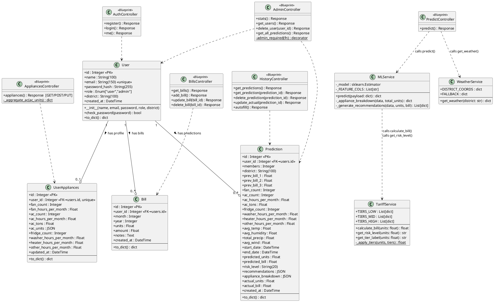

---

## 6. Sequence Diagrams

### SD-01 — User Registration

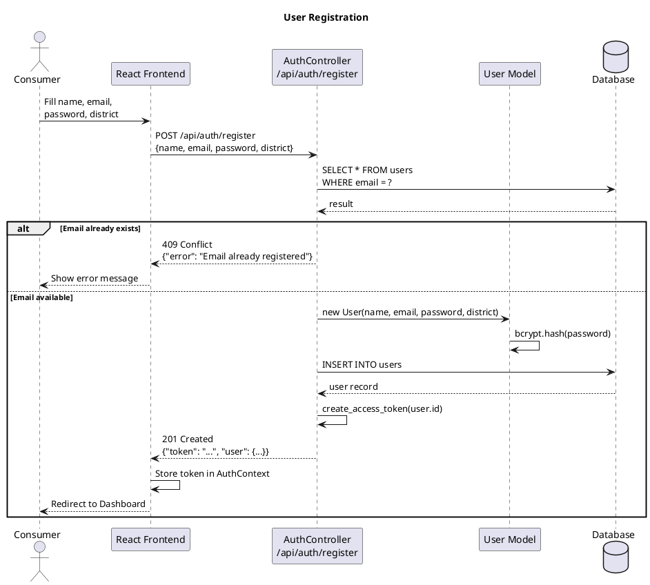

---

### SD-02 — User Login

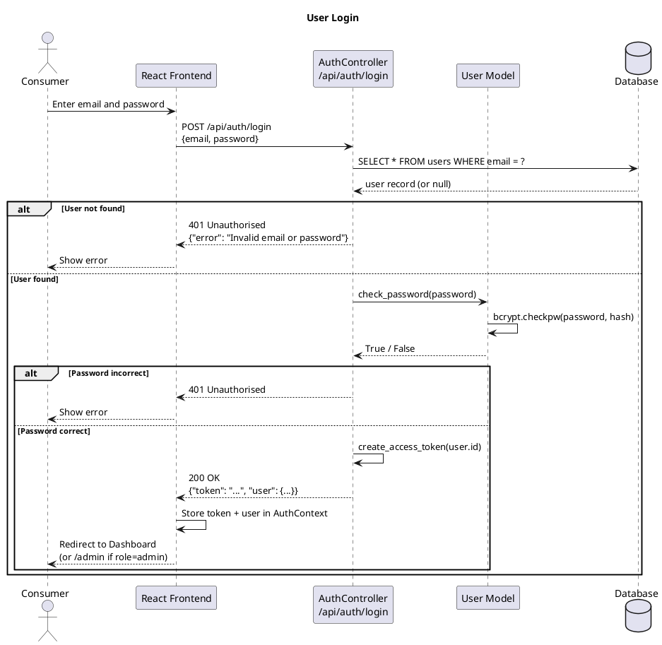

---

### SD-03 — Run Energy Prediction

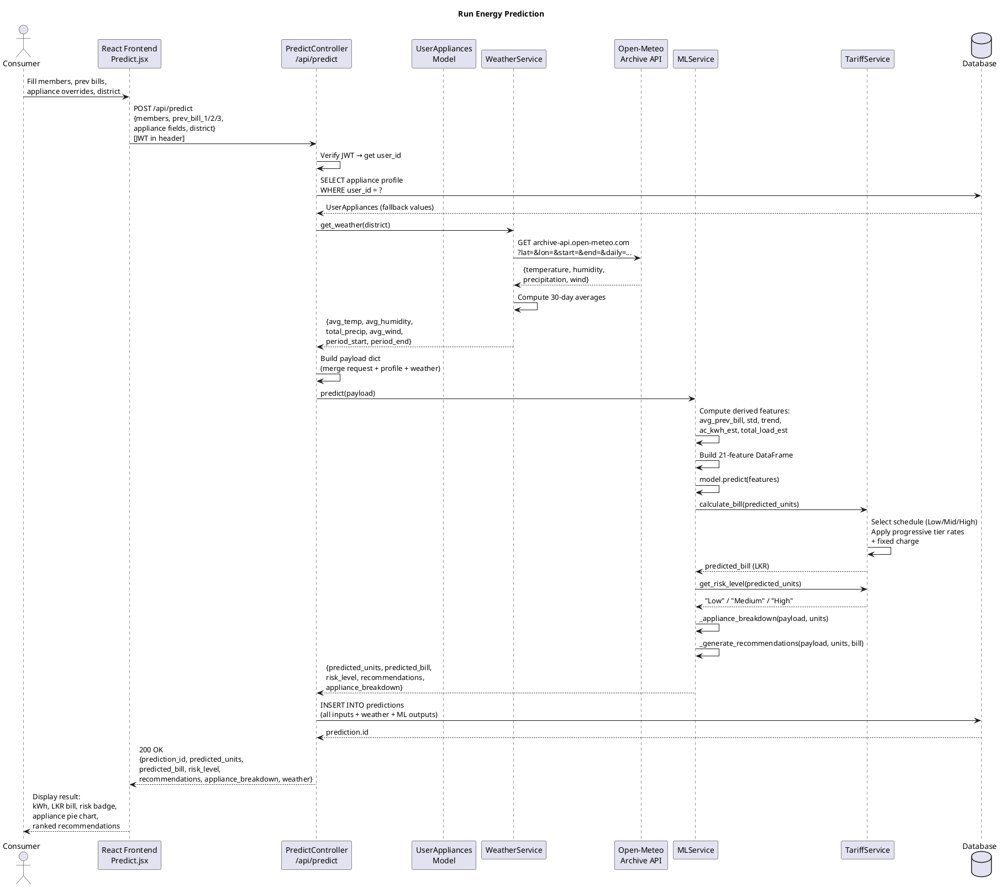

---

### SD-04 — Manage Appliance Profile (Create & Update)

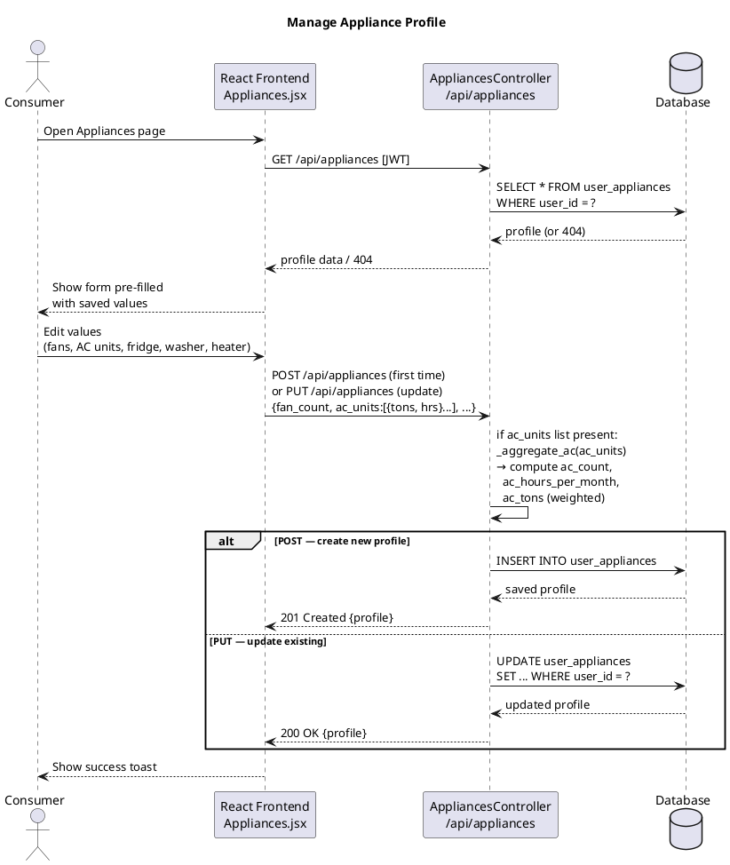

---

### SD-05 — Bill Record Management

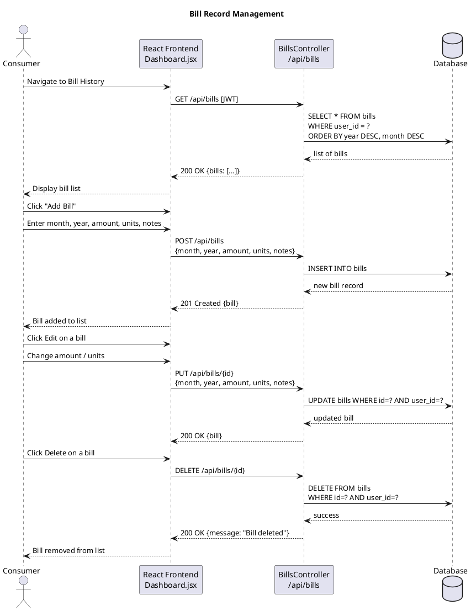

---

### SD-06 — Enter Actual Units After Billing Period

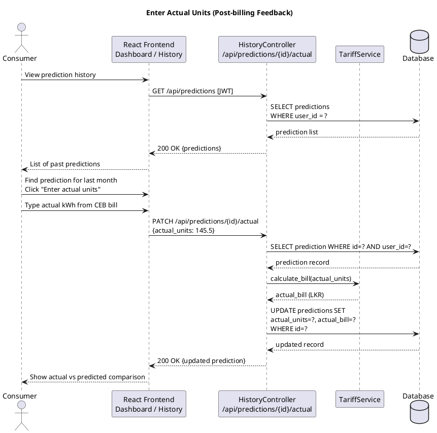

---

### SD-07 — Admin Views System Statistics

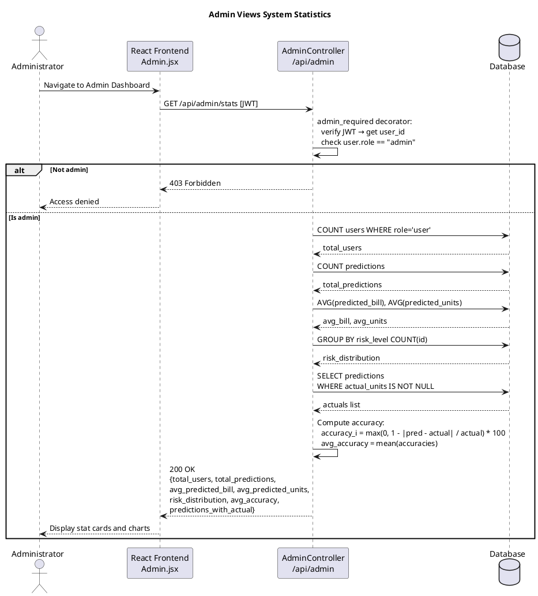

---

### SD-08 — Admin Deletes a User

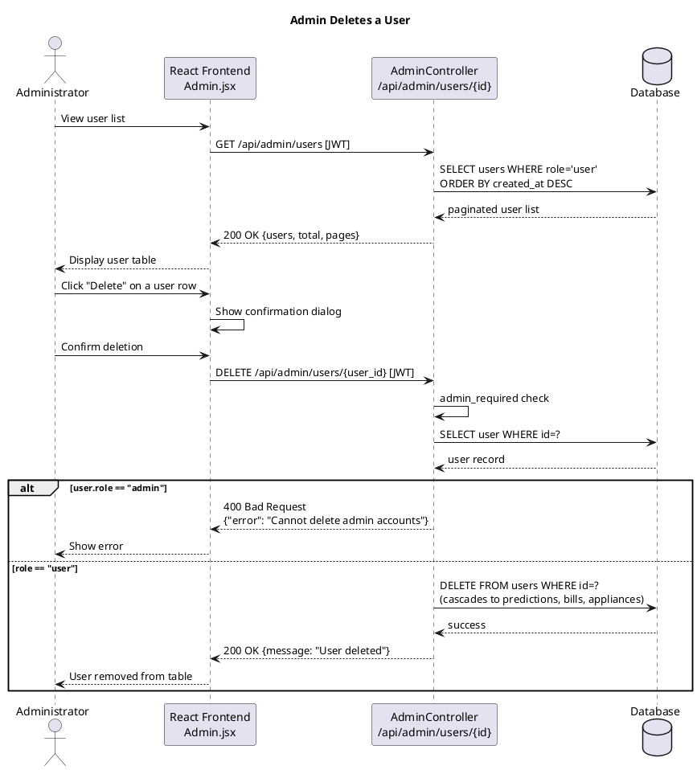

---

## 7. Database Entity Relationship Diagram

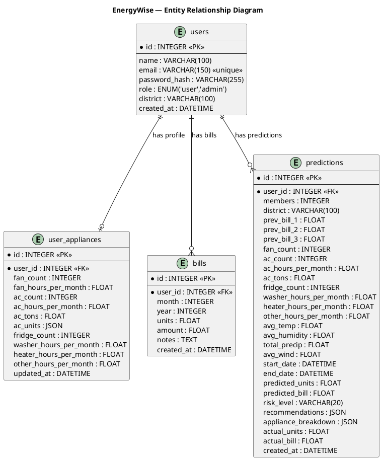

---

## 8. ML Feature Vector Summary

The trained model receives the following 21 features per prediction:

| # | Feature | Source | Description |
|---|---|---|---|
| 1 | `members` | User input | Number of people in household |
| 2 | `avg_prev_bill` | Derived | Mean of 3 previous bills (kWh) |
| 3 | `prev_month_consumption` | Derived | Most recent month's bill |
| 4 | `std_prev_3months` | Derived | Std deviation of 3 previous bills |
| 5 | `consumption_trend` | Derived | prev_bill_1 − prev_bill_2 |
| 6 | `fan_count` | Appliance profile | Number of fans |
| 7 | `fan_hours_per_month` | Appliance profile | Total fan run hours/month |
| 8 | `ac_count` | Appliance profile | Number of AC units |
| 9 | `ac_hours_per_month` | Appliance profile | Avg AC run hours/month |
| 10 | `ac_tons` | Appliance profile | Weighted avg AC capacity (tons) |
| 11 | `fridge_count` | Appliance profile | Number of refrigerators |
| 12 | `washer_hours_per_month` | Appliance profile | Washing machine hours/month |
| 13 | `heater_hours_per_month` | Appliance profile | Water heater hours/month |
| 14 | `other_hours_per_month` | Appliance profile | Other appliances hours/month |
| 15 | `avg_temp` | Open-Meteo API | 30-day average temperature (°C) |
| 16 | `avg_humidity` | Open-Meteo API | 30-day average relative humidity (%) |
| 17 | `total_precip` | Open-Meteo API | 30-day total precipitation (mm) |
| 18 | `avg_wind` | Open-Meteo API | 30-day average wind speed (km/h) |
| 19 | `month` | System clock | Current calendar month (1–12) |
| 20 | `ac_kwh_est` | Derived | `ac_count × ac_hrs × ac_tons × 0.7` |
| 21 | `total_load_est` | Derived | Sum of all appliance estimated kWh |

---

## 9. CEB Tariff Logic Summary

The `TariffService` implements the PUCSL-approved tariff (effective 11 May 2026).

| Schedule | Consumption | Fixed Charge | Progressive Rates |
|---|---|---|---|
| **Schedule 1 (Low)** | 0 – 60 kWh | LKR 80 (≤30) / LKR 210 (31–60) | LKR 5.00/unit (0–30), LKR 9.00/unit (31–60) |
| **Schedule 2 (Mid)** | 61 – 180 kWh | LKR 400 (≤90) / LKR 1,000 (≤120) / LKR 1,500 (≤180) | LKR 14–44/unit (progressive) |
| **Schedule 3 (High)** | > 180 kWh | LKR 2,500 | LKR 32.50/unit (≤180), LKR 100.00/unit (>180) |

Crossing a schedule boundary recalculates the **entire bill** at the new schedule's rates — not just the excess units. The recommendation engine explicitly checks proximity to these boundaries.

---

## 10. API Endpoint Summary

| Method | Endpoint | Auth | Actor | Purpose |
|---|---|---|---|---|
| POST | `/api/auth/register` | None | Consumer | Create account |
| POST | `/api/auth/login` | None | Consumer / Admin | Authenticate |
| GET | `/api/auth/me` | JWT | Any | Get current user |
| GET | `/api/appliances` | JWT | Consumer | Get appliance profile |
| POST | `/api/appliances` | JWT | Consumer | Create appliance profile |
| PUT | `/api/appliances` | JWT | Consumer | Update appliance profile |
| POST | `/api/predict` | JWT | Consumer | Run energy prediction |
| GET | `/api/bills` | JWT | Consumer | List bill records |
| POST | `/api/bills` | JWT | Consumer | Add bill record |
| PUT | `/api/bills/{id}` | JWT | Consumer | Edit bill record |
| DELETE | `/api/bills/{id}` | JWT | Consumer | Delete bill record |
| GET | `/api/predictions` | JWT | Consumer | Prediction history |
| GET | `/api/predictions/{id}` | JWT | Consumer | Single prediction detail |
| DELETE | `/api/predictions/{id}` | JWT | Consumer | Delete prediction |
| PATCH | `/api/predictions/{id}/actual` | JWT | Consumer | Enter actual units |
| GET | `/api/predictions/autofill` | JWT | Consumer | Auto-fill previous bills |
| GET | `/api/admin/stats` | JWT (admin) | Administrator | System statistics |
| GET | `/api/admin/users` | JWT (admin) | Administrator | All users (paginated) |
| DELETE | `/api/admin/users/{id}` | JWT (admin) | Administrator | Delete user |
| GET | `/api/admin/predictions` | JWT (admin) | Administrator | All predictions (paginated) |
| GET | `/api/weather` | JWT | Consumer | Weather for a district |
